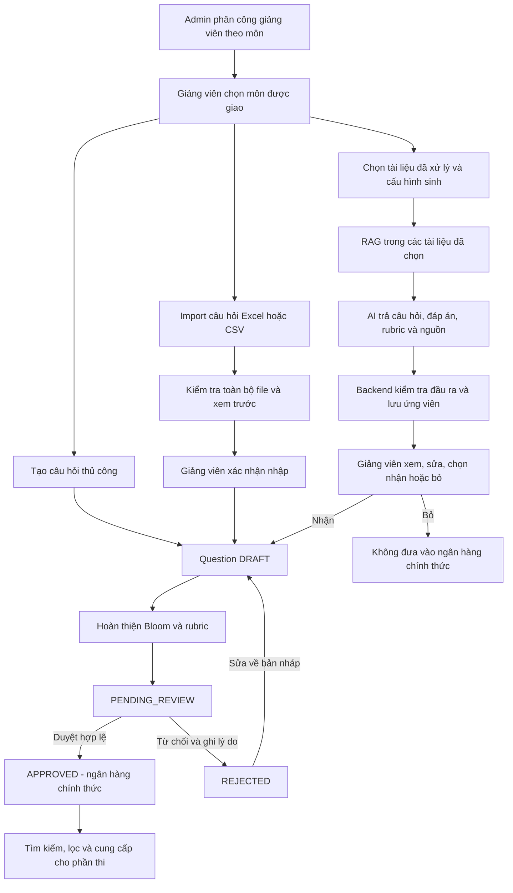

# Feature 1 — Quản lý ngân hàng câu hỏi & rubric

Ngày đối chiếu tài liệu/code: **07/10/2026 (UTC+7)**. Đối tượng sử dụng: toàn bộ nhóm AIVES, gồm backend, frontend, kiểm thử và người phụ trách migration.

Tài liệu mô tả luồng đích và kế hoạch hoàn thiện, **không có nghĩa mọi chức năng dưới đây đã được implement**. Các mục được phân biệt thành: **đã có**, **cần triển khai**, **đề xuất cần chốt**, **Phase 2**. Thay đổi nghiệp vụ đã thống nhất phải được trao đổi lại với Ân/nhóm trước khi code.

Nguồn yêu cầu chính: [requirements của giảng viên](../diagrams/project_requirements.png). Requirements mô tả giảng viên tạo/nhập/dùng AI sinh câu hỏi vấn đáp theo môn/chủ đề từ giáo trình, slide qua RAG; gắn Bloom và rubric; kiểm tra, chỉnh sửa, loại bỏ câu AI trước khi vào ngân hàng chính thức. Chưa có bảng trọng số chấm điểm của giảng viên trong tài liệu này: mục tiêu là bao phủ yêu cầu và có bằng chứng nghiệm thu, không cam kết điểm tối đa.

## Phần 1. Tổng quan quy trình chạy của Feature 1

### 1.1. Vai trò và kết quả đầu ra

- **Admin:** cấp quyền giảng viên, phân công giảng viên–môn; quản lý toàn bộ nhưng vẫn phải tuân thủ quy tắc trạng thái, version và bảo toàn dữ liệu đã dùng.
- **Giảng viên:** quản lý câu hỏi/tài liệu theo quyền trong môn được phân công; tự duyệt câu hỏi của mình; xem ngân hàng đã duyệt trong môn đó.
- **Sinh viên:** không truy cập trực tiếp ngân hàng, đáp án tham khảo, rubric chấm hoặc bản nháp. Công bố nội dung cho sinh viên là chức năng riêng, chưa thuộc MVP này.
- **AI:** tạo gợi ý, không có quyền tự phê duyệt hoặc tự mở rộng phạm vi tài liệu. Giảng viên chịu trách nhiệm kiểm tra nội dung.

Đầu ra chính thức là câu hỏi đang hoạt động, đã `APPROVED`, có Bloom và rubric hợp lệ; nguồn tạo và nguồn tài liệu có thể truy xuất. Feature 1 cung cấp danh sách/bộ lọc cho phần thi. Việc chọn câu vào phiên thi và chấm câu trả lời không được gộp vào Feature 1.

### 1.2. Luồng tổng thể đích



Sơ đồ mô tả đường đi thành công và quyết định chính. Nếu file/AI/dữ liệu không hợp lệ thì trả lỗi có thể xử lý; không tự bỏ qua validation để tiếp tục. Chỉ đường qua duyệt mới đưa câu vào ngân hàng chính thức.

### 1.3. Ba nguồn tạo câu hỏi

**Tạo thủ công — đã có CRUD cơ bản:** giảng viên nhập nội dung, chủ đề, Bloom, thời gian trả lời và đáp án tham khảo nếu có. Backend gán tác giả, `sourceType=MANUAL`, `status=DRAFT`, thời gian và version. Rubric được bổ sung qua nghiệp vụ riêng, không nhét trực tiếp vào DTO tạo Question hiện tại.

**Import — cần triển khai:** tải mẫu Excel/CSV → điền câu hỏi và tiêu chí rubric → upload → backend kiểm tra toàn bộ file → hiển thị dữ liệu xem trước/lỗi theo dòng và trường → xác nhận → lưu đồng thời câu hỏi/rubric thành bản nháp với nguồn `IMPORT`. Nếu còn dòng lỗi thì không lưu phần hợp lệ riêng. Nếu file thay đổi sau preview, phải kiểm tra lại đúng nội dung sẽ nhập.

**Sinh AI — cần hoàn thiện:** chọn môn, một hoặc nhiều tài liệu/phiên bản đã `READY`, chủ đề, số lượng và phân bổ Bloom → kiểm tra quyền → truy xuất chunk trong đúng phạm vi tài liệu → sinh ứng viên → kiểm tra kết quả → giảng viên chọn nhận hoặc loại bỏ. Kết quả được nhận tạo `DRAFT`, nguồn `AI`, rồi tiếp tục qua quy trình duyệt chung.

Hai bước **nhận kết quả AI thành bản nháp** và **duyệt bản nháp thành ngân hàng chính thức** khác nhau. UI phải thể hiện rõ; bấm nhận không đồng nghĩa câu đã được duyệt.

### 1.4. Vòng đời câu hỏi và điều kiện chuyển trạng thái

| Trạng thái/thao tác | Điều kiện và kết quả đích |
| --- | --- |
| Tạo → `DRAFT` | Đúng môn, đúng quyền; chưa bắt buộc có Bloom/rubric |
| `DRAFT` → `PENDING_REVIEW` | Kiểm tra mức hoàn thiện theo hợp đồng gửi duyệt; đề xuất kiểm tra đủ Bloom/rubric ngay ở đây để giảm vòng sửa |
| `PENDING_REVIEW` → `APPROVED` | Bắt buộc nội dung hợp lệ, có Bloom và rubric tổng 10; lưu người/thời điểm duyệt |
| `PENDING_REVIEW` → `REJECTED` | Người có quyền từ chối và ghi lý do |
| `REJECTED` → `DRAFT` → gửi lại | Cho phép chỉnh sửa có kiểm soát; giữ lịch sử từ chối, không sửa trực tiếp trạng thái bằng PATCH tùy ý |
| Sửa câu/rubric đã `APPROVED` | Đưa nội dung sửa về `DRAFT`, không được chọn cho bài thi mới; nếu đã dùng, giữ nguyên nội dung/điểm của bài thi cũ bằng snapshot hoặc phiên bản bất biến |
| Lưu trữ | Ngừng chọn cho bài thi mới, không xóa dấu vết; không được chỉnh sửa như bản nháp đang hoạt động |
| Khôi phục | Phải kiểm tra lại quyền, tình trạng nội dung và rubric; quy tắc có phải duyệt lại cần chốt trước triển khai |

Hiện tại CRUD chỉ sửa/xóa `DRAFT` chưa lưu trữ, chưa có tham chiếu bài thi. Bảng trên là yêu cầu cần bổ sung, không phải mô tả toàn bộ hành vi hiện có. `archivedAt` là trục lưu trữ riêng; không tự thêm `ARCHIVED` vào enum trạng thái duyệt khi chưa có thiết kế được duyệt.

### 1.5. Luồng Learning Material phục vụ RAG

1. Giảng viên chọn môn được phân công và upload tài liệu được phép sử dụng.
2. Kiểm tra quyền, dung lượng, định dạng, tính an toàn của file và tên file.
3. Lưu metadata/file, xử lý trích xuất chữ, chia chunk, tạo embedding theo cấu hình đã chọn.
4. Chỉ đánh dấu `READY` khi đầu ra cần thiết đã được lưu đầy đủ. Lỗi phải có trạng thái và thông báo, không giả vờ đã xử lý thành công.
5. Mỗi chunk truy ngược được tài liệu/phiên bản; lưu vị trí trang, đoạn, sheet/dòng khi parser xác định được, không tự bịa số trang.
6. Thay file tạo phiên bản mới và xử lý lại; đổi tiêu đề không làm mất liên kết nguồn.
7. Tài liệu đã được tham chiếu chỉ lưu trữ/ngừng sử dụng, không xóa mất bằng chứng nguồn. Phạm vi ảnh hưởng tới câu hỏi đã duyệt cần chốt, không tự cascade xóa.

## Phần 2. Các điều cần làm tiếp để hoàn thành Feature 1 theo requirements

### 2.1. Hiện trạng backend tại thời điểm viết

| Thành phần | Đã có | Còn thiếu/không được hiểu nhầm |
| --- | --- | --- |
| Question CRUD | POST/GET danh sách/GET chi tiết/PATCH/DELETE, phân quyền, lọc, version, audit tạo/sửa/xóa | Chưa có workflow duyệt, import hoặc sinh câu hỏi AI |
| Rubric | Entity `Rubric`, `RubricCriterion`, quan hệ một rubric riêng/câu hỏi | Chưa có controller/service quản lý rubric và tiêu chí |
| Phân công môn | Entity/bảng `lecturer_subject_assignments`; CRUD Question đã kiểm tra phân công | Chưa có API quản trị phân công; đang phải chuẩn bị dữ liệu riêng |
| Learning Material | Upload/xử lý RAG, danh sách theo môn; parser/chunk/embedding đã có nền tảng | Chưa đủ CRUD/vòng đời, version nguồn, Excel/CSV và quyền sở hữu/phân công theo nghiệp vụ đã chốt |
| Audit | Ghi các sự kiện `CREATED`, `UPDATED`, `DELETED` của Question | Chưa đủ lịch sử duyệt/từ chối/lưu trữ/import/sinh AI; constraint action hiện tại không nhận tùy ý sự kiện mới |
| Kiểm thử | Lần chạy 06/10/2026: 58 test nhanh + 17 PostgreSQL đạt | Không phải test toàn bộ Feature 1, không chứng minh cấu hình Supabase thực tế luôn ổn định |
| Kết nối database | Cấu hình Hikari mặc định đã có max 2/min idle 0 trong repository hiện tại | Mỗi máy phải cập nhật/restart; cấu hình không thay thế việc giám sát số client của pool Supabase |

### 2.2. Đối chiếu yêu cầu với bằng chứng cần trình bày

| Nội dung trong requirements Feature 1 | Chức năng phải hoàn thiện | Bằng chứng nghiệm thu/demo |
| --- | --- | --- |
| Giảng viên tạo câu hỏi | Luồng thủ công, môn/chủ đề, phân quyền | Tạo bản nháp, sửa/xóa hợp lệ; tài khoản sai quyền bị chặn |
| Nhập câu hỏi | Import Excel/CSV kèm rubric | File đúng nhập được; file sai báo đúng dòng/trường và không lưu một phần |
| AI sinh từ giáo trình/slide bằng RAG | Tài liệu, chunk/embedding, truy xuất có phạm vi, sinh và lưu kết quả | Chỉ chọn tài liệu A/B, chứng minh kết quả có nguồn thuộc A/B, không lấy tài liệu môn khác |
| Câu hỏi theo môn/chủ đề | Quan hệ môn, nhiều nhãn, bộ lọc và truy vấn có quyền | Một câu có nhiều nhãn; lọc đúng môn/chủ đề mà không lộ bản nháp người khác |
| Bloom: nhớ, hiểu, vận dụng, phân tích | Bốn mức, phân bổ khi sinh, điều kiện duyệt | Thiếu Bloom không duyệt; giảng viên đọc và xác nhận mức nhận thức, không chỉ kiểm tra tên enum |
| Rubric gồm tiêu chí và thang điểm | Nội dung tiêu chí, mô tả cách cho điểm, tổng điểm và liên kết câu hỏi | Xem rubric cụ thể; tổng khác 10 bị từ chối theo quy tắc đã chốt |
| Duyệt, sửa, loại bỏ câu AI trước khi nhập ngân hàng | Khu vực ứng viên, quyết định nhận/bỏ, workflow duyệt | Câu chưa nhận/chưa duyệt không có trong ngân hàng chính thức; thao tác sửa/bỏ có tác dụng rõ ràng |
| Làm căn cứ AI chấm sau này | Rubric/đáp án có hợp đồng đầu ra, bảo toàn khi đã dùng | Minh họa dữ liệu sẵn sàng cho Feature 4, không tuyên bố đã có AI chấm nếu mới làm Feature 1 |

Requirements nhắc tới **slide bài giảng**, còn nhóm đã chọn PowerPoint cho Phase 2. MVP dự kiến dùng slide xuất PDF để đi qua cùng pipeline tài liệu; cần đối chiếu với giảng viên nếu việc nhận file PowerPoint gốc là tiêu chí bắt buộc. Không mặc định một chức năng được hoãn vẫn đáp ứng hoàn toàn yêu cầu chấm điểm.

### 2.3. Backlog triển khai theo phụ thuộc

| Mã | Ưu tiên/thứ tự | Việc cần làm | Hoàn thành khi |
| --- | --- | --- | --- |
| F1-01 | Tiếp theo | Rubric + tiêu chí như một khối dữ liệu; API xem/lưu/sửa/xóa và phân quyền | Tổng điểm/precision/validation được chốt; lưu nguyên tử; không sửa rubric để vượt qua khóa trạng thái của Question |
| F1-02 | Sau F1-01 | Gửi duyệt, duyệt/từ chối, sửa để gửi lại, audit và danh sách ngân hàng | Chuyển trạng thái đúng, có người duyệt/lý do, chỉ `APPROVED` hoạt động được chọn |
| F1-03 | Có thể làm song song sau chốt hợp đồng | API admin quản trị phân công; API giảng viên xem môn được giao | Thêm/gỡ lặp lại an toàn; chỉ user có role phù hợp; không phân công tới môn không tồn tại |
| F1-04 | Trước AI thật | Hoàn thiện Learning Material: quyền, chi tiết, phân trang, đổi tiêu đề, thay phiên bản, lưu trữ, Excel/CSV | Có trạng thái xử lý, nguồn truy xuất ổn định và lỗi không trích xuất được chữ |
| F1-05 | Sau F1-01 và hợp đồng import | Mẫu Excel/CSV, kiểm tra/xem trước, xác nhận nhập | Không lưu khi còn lỗi; tạo cả câu hỏi/rubric bản nháp; chống nhập trùng do gửi lại xác nhận |
| F1-06 | Sau hợp đồng F1-01/F1-04 | Yêu cầu sinh và kết quả ứng viên bằng provider giả lập | Có thể demo yêu cầu → xem kết quả → sửa/nhận/bỏ → bản nháp → duyệt mà không cần AI key |
| F1-07 | Sau F1-06 và xác nhận AI service | Gắn truy xuất tài liệu/AI thật; timeout, retry có giới hạn, theo dõi chi phí/lỗi | Test phạm vi tài liệu, đầu ra sai/thiếu, nguồn không hợp lệ, gửi lại và lỗi nhà cung cấp |
| F1-08 | Xuyên suốt; bắt buộc trước dùng trong thi | Lưu trữ/khôi phục, bảo toàn dữ liệu đã dùng, hợp đồng snapshot/version với phần thi | Sửa ngân hàng không thay đổi câu hỏi/rubric/điểm của bài thi đã tạo |
| F1-09 | Mỗi hạng mục và cuối đợt | UI, API contract, test, tài liệu, kịch bản demo và rà soát bảo mật | Người khác pull cùng commit, chạy được test và tái hiện được luồng mà không thao tác tay vào DB cho từng bước |

**Mốc đầu tiên nên hoàn thành:** tạo câu thủ công → gắn rubric → gửi duyệt → duyệt/từ chối → tìm trong ngân hàng. Sau đó nối import và AI vào cùng nghiệp vụ. Không tạo ba cơ chế lưu/duyệt khác nhau cho MANUAL, IMPORT và AI.

### 2.4. Hợp đồng chức năng cần chốt trước code

Các mục dưới đây là nhóm API cần thiết, chưa phải tên route cuối cùng:

- **Rubric:** lấy rubric theo Question; lưu/cập nhật đồng thời rubric + toàn bộ tiêu chí; xóa theo quyền/trạng thái. Sao chép rubric chỉ thêm khi nhóm xác nhận cách tái sử dụng.
- **Review:** gửi duyệt, quyết định duyệt/từ chối, đưa về bản nháp theo nghiệp vụ; lịch sử thao tác. Backend quyết định quyền và điều kiện, không nhận trạng thái bất kỳ từ client.
- **Assignments:** danh sách/thêm/gỡ phân công dành cho admin; danh sách môn được giao dành cho giảng viên.
- **Materials:** upload, danh sách có phân trang, chi tiết/trạng thái xử lý, đổi tiêu đề, thêm phiên bản file, lưu trữ; quyền tải file nguồn phải được kiểm tra riêng.
- **Imports:** lấy mẫu, tạo phiên kiểm tra, xem lỗi/preview, xác nhận lưu. Gắn xác nhận với người dùng, môn và chính phiên/file đã được kiểm tra.
- **Generation:** tạo yêu cầu, xem trạng thái/kết quả, xem nguồn, nhận/bỏ ứng viên. Đề xuất xử lý dạng job và polling để không giữ HTTP request quá lâu; chưa bắt buộc Kafka, microservice hay hàng đợi ngoài.

Mỗi API mới phải có DTO request/response, lỗi nghiệp vụ, quyền, điều kiện trạng thái, version/idempotency và ví dụ OpenAPI trước khi frontend tích hợp. Giữ envelope `ApiResponse` và quy ước phân trang hiện có; không tự đổi hợp đồng Question CRUD đã hoạt động.

## Phần 3. Constraints và lưu ý khi xây dựng

### 3.1. Phân quyền theo nghiệp vụ

| Thao tác | Admin | Giảng viên | Sinh viên |
| --- | --- | --- | --- |
| Phân công giảng viên–môn | Được quản lý | Không tự cấp phân công | Không |
| Tạo câu/import/sinh AI | Trong môn tồn tại | Chỉ môn được phân công | Không |
| Xem bản nháp | Trong phạm vi quản trị | Của mình, trong môn được phân công | Không |
| Xem ngân hàng đã duyệt | Được | Trong môn được phân công | Không |
| Sửa/xóa câu hoặc rubric | Có nhưng tuân thủ trạng thái/tham chiếu | Chủ sở hữu + còn phân công + hợp lệ theo trạng thái | Không |
| Duyệt/từ chối | Được | Câu của mình trong môn được phân công | Không |
| Sửa/xóa/thay tài liệu | Quản lý toàn bộ theo quy tắc bảo toàn nguồn | Chỉ tài liệu của mình trong môn được phân công | Không |

Quyền đọc/dùng tài liệu của giảng viên khác chưa được xác nhận đủ rõ: không suy ra rằng cùng môn thì đương nhiên được tải file hoặc đưa file vào AI. Phải chốt trước F1-04/F1-06. Admin ứng dụng không đồng nghĩa role `postgres`, quyền Supabase Dashboard hoặc quyền RLS.

### 3.2. Dữ liệu câu hỏi và rubric

| Nội dung | Quy tắc |
| --- | --- |
| Nội dung Question | Văn bản không trắng; giới hạn hiện tại 10.000 ký tự; chưa có ảnh đính kèm riêng |
| Đáp án tham khảo | Không bắt buộc với câu thủ công; tối đa 20.000 ký tự theo DTO hiện tại. Luồng AI yêu cầu sinh đáp án nháp |
| Môn | Một câu thuộc một môn; không đổi môn qua PATCH Question hiện tại |
| Chủ đề | Một câu có thể có nhiều nhãn; MVP dùng chuỗi, chưa cần CRUD Topic; hiện tối đa 10 nhãn đầu vào, mỗi nhãn 1–100 ký tự, chuẩn hóa Unicode và loại trùng không phân biệt hoa/thường |
| Bloom | `REMEMBER`, `UNDERSTAND`, `APPLY`, `ANALYZE`; bản nháp có thể null, trước khi duyệt phải có |
| Thời gian trả lời | Số nguyên dương tính bằng giây hoặc null theo CRUD hiện tại; không đồng nghĩa đã implement bộ đếm thời gian bài thi |
| Nguồn | `MANUAL`, `IMPORT`, `AI`; backend gán theo luồng, không cho client giả mạo qua CRUD thủ công |
| Rubric | Thiết kế hiện tại tối đa một rubric riêng/câu; bản nháp được chưa có, trước khi duyệt bắt buộc có |
| Tiêu chí | Có nội dung/mô tả cách cho điểm; tổng điểm tối đa của rubric hợp lệ bằng 10; dùng `BigDecimal`, hỗ trợ điểm lẻ |
| Làm tròn/precision | Entity hiện dùng `NUMERIC(5,2)`; cần chốt giới hạn số tiêu chí, điểm tối thiểu và xử lý số lẻ vượt precision trước API, không âm thầm làm tròn khiến tổng đổi |
| `isMandatory` | Field đã tồn tại trong entity nhưng MVP không áp dụng quy tắc trượt cả câu; không tự bật quy tắc chỉ vì database có field |
| Nháp rubric chưa đủ điểm | Cần chốt có cho lưu nháp rubric chưa đủ tổng 10 hay chỉ cho lưu rubric hợp lệ; dù chọn cách nào, trước duyệt luôn phải đủ điều kiện |

Rubric dùng lại giữa nhiều câu là quyết định chưa chốt. Đề xuất MVP: sao chép thành bản riêng để giữ mô hình 1–1; không tự đổi sang nhiều câu cùng sửa một rubric dùng chung. Nếu cần thư viện template/version phải thiết kế tác động tới các câu đã gắn trước khi migration.

### 3.3. Trạng thái, idempotency và bảo toàn dữ liệu

- `@Version`/`expectedVersion` chống ghi đè, **không thay thế snapshot hoặc lịch sử nội dung**.
- PATCH hiện phân biệt trường bị bỏ qua với trường gửi null; không đổi ý nghĩa này khi thêm workflow.
- POST Question thủ công hiện chưa có Idempotency-Key: gửi lại tạo câu mới. Không mô tả rằng mọi API đã idempotent. Không cấm nội dung giống nhau chỉ để chống double-click.
- Với xác nhận import, nhận kết quả AI và thao tác duyệt: cần cơ chế chống thao tác lặp có chủ đích, cùng transaction với dữ liệu/audit; nếu dùng key phải gắn theo actor + thao tác + payload, cùng key khác payload trả conflict.
- Lưu Question + rubric + tiêu chí khi import/nhận ứng viên phải nguyên tử. Không lưu câu một nửa nếu rubric lỗi.
- Câu đã dùng chỉ được lưu trữ hoặc sửa thông qua thiết kế phiên bản phù hợp; không xóa mất tham chiếu bài thi/audit.
- Sửa rubric cũng là thay đổi dữ liệu chấm: phải chịu cùng quy tắc bảo vệ như sửa nội dung Question.
- Rà soát API xóa Subject/User và cascade trước khi tích hợp bài thi; không chỉ bảo vệ DELETE Question rồi để đường xóa khác làm mất dữ liệu.
- Audit cần actor, thời gian, hành động, lý do khi phù hợp; duyệt/lưu trữ và nguồn AI cần mở rộng thiết kế audit hiện tại. Không ghi token, mật khẩu, API key vào log.
- Nếu snapshot cho bài thi chưa có, tiếp tục chặn thay đổi câu đã được tham chiếu như hiện tại; không bỏ chặn để hoàn thành demo nhanh.

### 3.4. File, RAG và AI

- Learning Material MVP theo quyết định nhóm: PDF, Word, Excel, CSV; tối đa **20 MB/file**, chưa OCR. Parser không lấy được chữ phải báo rõ, không chuyển READY với dữ liệu rỗng.
- Import Question MVP: Excel/CSV theo mẫu; không Word hoặc file tự do. Hai loại upload có mục đích và validation khác nhau.
- Cần chốt đuôi cụ thể (ví dụ `.xlsx`/`.xls`, `.docx`/`.doc`), encoding CSV, delimiter, cấu trúc nhiều rubric criteria và giới hạn số dòng import; đừng chỉ dựa vào tên định dạng.
- Code hiện còn whitelist `pdf, docx, doc, pptx, ppt, txt, md`. Cần đối chiếu lại contract/UI/test khi triển khai F1-04; việc parser hỗ trợ không có nghĩa mọi định dạng thuộc phạm vi nghiệm thu MVP. Không tự xóa hỗ trợ hiện có mà chưa đánh giá tương thích.
- Kiểm tra MIME/nội dung phù hợp, chống path traversal và file giả đuôi; đặt giới hạn xử lý file nén/Excel, số sheet/dòng/chunk để tránh tốn bộ nhớ quá mức. Lưu file ngoài webroot và kiểm soát quyền tải xuống.
- Chỉ truy xuất chunk thuộc môn, tài liệu và phiên bản đã chọn mà người gọi được phép dùng. Áp dụng điều kiện này ngay trong truy vấn truy xuất, không chỉ lọc sau khi đã gửi nội dung sang AI.
- Tài liệu và đầu ra AI là dữ liệu không tin cậy. Nội dung trong tài liệu không được biến thành chỉ thị vượt quyền, thay prompt hệ thống hoặc mở phạm vi dữ liệu. Kiểm tra schema, enum, độ dài, tổng điểm và liên kết nguồn trước khi lưu.
- Thiếu bằng chứng trong tài liệu thì trả kết quả thiếu nội dung/lỗi nghiệp vụ; không tự bù kiến thức ngoài hoặc tạo nguồn tham chiếu giả. Lời nhắc “chỉ dùng tài liệu” không đủ để chứng minh tính đúng; cần nguồn thật và kiểm tra của giảng viên.
- Mức **20 câu/lần** là đề xuất của Ân để thiết kế MVP; cần xác nhận giới hạn vận hành với model/token/chi phí. Tổng phân bổ Bloom phải bằng tổng số câu. Kết quả ít hơn yêu cầu không được báo là hoàn thành đủ.
- AI sinh câu hỏi + đáp án + rubric nháp + nguồn; lưu nhà cung cấp/model và phiên bản cấu hình sinh khi đã chọn. Có thể một câu dùng nhiều chunk/tài liệu, không thiết kế nguồn chỉ bằng một đoạn text tự do.
- Timeout/retry có giới hạn; tránh retry không kiểm soát gây tăng phí hoặc nhận kết quả hai lần. Phải chốt cách xử lý batch thiếu một phần, lỗi rubric và ứng viên trùng trước code.
- Không gửi dữ liệu tài khoản hoặc tài liệu ngoài phạm vi cho nhà cung cấp AI. Chốt quyền sử dụng tài liệu và phạm vi truyền dữ liệu trước tích hợp external service.
- Nếu đổi model embedding có số chiều khác, phải có kế hoạch vector schema/re-index; hiện mapping là 1536 chiều. Không trộn embedding không tương thích vào cùng chỉ mục một cách âm thầm.

### 3.5. Kiến trúc và database

- Giữ **Traditional Monolith**: controller → service → service/impl → repository; entity tách DTO request/response. Không trả entity JPA trực tiếp.
- Luồng thủ công/import/AI dùng chung quy tắc nghiệp vụ nhưng có điểm vào riêng để backend gán đúng nguồn. Adapter AI chỉ lo giao tiếp nhà cung cấp, không quyết định phê duyệt.
- Giữ lỗi thống nhất với API hiện có: 400 dữ liệu không hợp lệ, 401 xác thực, 403 quyền, 404 không tồn tại/không được xem theo chính sách hiện tại, 409 version/trạng thái/xung đột. Không lộ SQL hay nội bộ hệ thống trong response.
- Class/field/method Java mới phải có Javadoc tiếng Việt Unicode UTF-8 theo quy ước của nhóm. Tài liệu API, test và code đi cùng một thay đổi.
- Không giữ transaction database trong lúc chờ đọc file lớn/gọi AI. Tách lần ghi trạng thái ngắn, xử lý bên ngoài, rồi ghi kết quả ngắn; kiểm thử cả trạng thái FAILED, cleanup và retry. Không chỉ bỏ `@Transactional` mà bỏ qua tính nhất quán.
- **Không tự ý thay đổi database.** Trước thay schema phải trình bày thay đổi, dữ liệu bị ảnh hưởng, phương án migration/rollback và được Ân/người có thẩm quyền cho phép. Cho phép sửa file không đồng nghĩa được chạy SQL lên Supabase.
- Migration đã áp dụng không được sửa để thêm thay đổi mới. Tạo file migration mới; đồng bộ SQL khởi tạo, diagram và nhật ký. Không dùng SQL khởi tạo để nâng cấp database đã có.
- Giữ `ddl-auto: none` cho database dùng chung; test PostgreSQL dùng `validate`. Không bật `update` để tự chữa thiếu schema.
- Một người phụ trách áp dụng migration sau backup/precheck. Các thành viên dùng cùng Supabase chỉ pull code và refresh datasource, không mỗi người chạy lại SQL.
- Hikari max 2 hiện là cấu hình dev khởi đầu, không bảo đảm hết lỗi EMAXCONNSESSION nếu nhiều instance/công cụ còn giữ kết nối. Theo dõi ngân sách kết nối của cả nhóm; không tự tăng pool hoặc ngắt session người khác.

## Phần 4. Các phần có thể xây dựng/nâng cấp lên

Các phần sau không tự động trở thành yêu cầu của MVP. Chỉ làm sau khi luồng lõi đã được nghiệm thu hoặc được nhóm/giảng viên ưu tiên lại.

| Hạng mục | Giá trị | Điều kiện/lưu ý |
| --- | --- | --- |
| PowerPoint | Nhận slide gốc, giữ nguồn slide | Nhóm đã xếp Phase 2; vẫn phải làm rõ yêu cầu slide của giảng viên cho MVP |
| Import Question Word theo mẫu | Nhập được tài liệu soạn sẵn có cấu trúc | Có mẫu cố định, preview và lỗi theo vị trí; Phase 2 |
| Import Word tự do bằng AI | Nhận diện câu/rubric từ tài liệu không theo mẫu | Giảng viên bắt buộc kiểm tra trước khi nhập bản nháp; Phase 2 |
| OCR | Đọc PDF scan/ảnh | Đánh giá độ chính xác, chi phí và thông báo phần OCR không chắc chắn |
| Rubric template và version | Tái sử dụng có quản lý thay vì copy thủ công | Chốt quyền sửa, phiên bản gắn với câu và tác động tới bài thi cũ |
| `isMandatory` có tác động chấm | Xử lý thiếu/sai ý bắt buộc | Chốt rõ thế nào là trượt, điểm còn lại, giải thích và quyền giảng viên trước khi dùng; Phase 2 |
| CRUD Topic/taxonomy | Chuẩn hóa tên chủ đề, alias, cây chủ đề | Có migration từ nhãn chuỗi; không bắt buộc cho MVP |
| Phát hiện câu trùng/gần trùng | Giảm câu AI/import lặp | Chỉ gợi ý để giảng viên quyết định, không cấm mọi câu giống nội dung |
| Hai người duyệt, duyệt hàng loạt | Tăng kiểm soát/chất lượng | Là thay đổi nghiệp vụ; MVP đang cho tự duyệt, không âm thầm bắt thêm người duyệt |
| Xử lý nền có hàng đợi và báo tiến độ | Phục hồi job, mở rộng số người dùng | Chỉ thêm hạ tầng khi có nhu cầu; không bắt buộc tách khỏi monolith |
| Bộ đánh giá RAG/Bloom và thống kê | Đo chất lượng theo môn, model, cấu hình | Có tập dữ liệu giảng viên xác nhận; không lấy đánh giá tự thân của AI làm bằng chứng duy nhất |

Snapshot/version bảo toàn dữ liệu đã dùng **không phải tiện ích tùy chọn có thể bỏ qua khi mở tích hợp bài thi**. Chỉ có thể hoãn việc triển khai cụ thể khi vẫn giữ chặn chỉnh sửa dữ liệu đang được tham chiếu.

## Phần 5. Các quyết định cần xác nhận trước từng đợt code

| Quyết định | Đã biết | Cần chốt |
| --- | --- | --- |
| Tái sử dụng rubric | Hiện quan hệ 1–1; có nhu cầu dùng tiêu chí giống nhau | Copy độc lập hay template/version; không mặc định dùng chung một bản sửa được |
| Draft rubric và điểm | Tổng rubric hợp lệ bằng 10, hỗ trợ điểm lẻ | Có cho lưu rubric chưa đủ điểm không; số tiêu chí; điểm 0; precision và làm tròn |
| Tài liệu cùng môn | Chỉ sửa/xóa tài liệu của mình, admin toàn bộ | Người cùng môn có được đọc/tải/dùng tài liệu của nhau làm nguồn AI không |
| Import | Excel/CSV, preview, toàn bộ hợp lệ mới lưu | Chọn mẫu cụ thể, sheet/cột, biểu diễn nhiều tiêu chí, encoding/delimiter, số dòng tối đa, thời hạn preview |
| File học liệu | PDF/Word/Excel/CSV, 20 MB, không OCR | Đuôi hỗ trợ cụ thể; cách giữ TXT/MD đang có; xác nhận demo slide PDF với giảng viên |
| Job AI | Chọn tài liệu/chủ đề/Bloom, nhận/bỏ kết quả, không tự duyệt | Provider/model/ngân sách, xác nhận giới hạn 20, timeout/retry, kết quả một phần và trùng câu |
| Sửa câu đã duyệt/khôi phục | Sửa về nháp; bài thi cũ không đổi | Cơ chế revision/snapshot, khôi phục có phải duyệt lại và ảnh hưởng câu được lấy cho kỳ thi tương lai |
| Lưu trữ tài liệu | Không mất nguồn đã tham chiếu | Có ngăn job mới dùng tài liệu đó; xử lý job đang chạy và câu đã duyệt như thế nào |

Các tên D1/D2 trong trao đổi trước không đủ để suy ra chi tiết nếu thiếu nội dung quyết định. Khi đưa vào code, ghi lại quyết định đầy đủ vào tài liệu/PR, không chỉ ghi “đã đồng ý”.

## Phần 6. Checklist nghiệm thu và kịch bản demo

### 6.1. Checklist chức năng

- [ ] Admin phân công giảng viên vào môn bằng chức năng quản trị; giảng viên chọn được môn đã giao.
- [ ] Tạo câu thủ công và rubric hợp lệ; nguồn MANUAL/tác giả do backend gán.
- [ ] Gửi duyệt, duyệt, từ chối có lý do, sửa và gửi lại hoạt động đúng; thiếu Bloom/rubric không được duyệt.
- [ ] Ngân hàng chính thức chỉ hiển thị câu APPROVED đang hoạt động trong đúng phạm vi quyền.
- [ ] Import file đúng tạo cả câu và rubric; file sai không ghi một phần; confirm lặp không tạo thêm dữ liệu.
- [ ] Học liệu đúng định dạng/dung lượng xử lý được; PDF scan không OCR trả lỗi rõ; người không có quyền không truy cập được file/chunk.
- [ ] Sinh giả lập đủ luồng trước; sau tích hợp, có lần demo AI thật với nguồn kiểm chứng được.
- [ ] Giảng viên chỉnh sửa, nhận một số ứng viên và loại bỏ số khác; ứng viên bỏ không vào ngân hàng chính thức.
- [ ] Câu đã dùng và nguồn đã tham chiếu được bảo toàn khi sửa/lưu trữ.
- [ ] Không tự chấm điểm sinh viên hoặc tự công bố rubric cho sinh viên trong Feature 1.

### 6.2. Checklist chất lượng kỹ thuật

- [ ] Test role + ownership + assignment cho từng API, kể cả quyền thay đổi sau khi token/job/preview được tạo.
- [ ] Test request sai kiểu, trường lạ, giới hạn độ dài/số lượng, số lẻ và trạng thái không hợp lệ.
- [ ] Test version cũ, request lặp, hai thao tác đồng thời và rollback audit/Question/rubric.
- [ ] Test migration PostgreSQL từ dữ liệu cũ, chạy lại an toàn theo thiết kế, rollback khi lỗi; không chỉ dựa vào H2.
- [ ] Test nguồn tài liệu ngoài môn/ngoài lựa chọn, nguồn do AI bịa, JSON sai, tổng rubric sai, phân bổ Bloom thiếu và nội dung chỉ thị độc hại trong tài liệu.
- [ ] Test external AI timeout, lỗi quota/rate limit, output thiếu và retry; không dùng API thật cho test mặc định.
- [ ] Kiểm tra câu hỏi vấn đáp phù hợp, đáp án có căn cứ và mức Bloom thực chất bằng đánh giá của giảng viên; kiểm tra enum không thay thế kiểm tra chất lượng.
- [ ] OpenAPI, ví dụ request/response, lỗi, hướng dẫn môi trường và diagram được cập nhật cùng code.
- [ ] Không đưa secrets/backup dữ liệu thật vào Git; không phát sinh thay đổi Supabase từ lệnh test thông thường.

Chạy test tại `avies-backend` bằng JDK 21:

```powershell
# Test nhanh, không cần Docker, không gọi Supabase/AI thật.
mvn test

# Mở Docker Desktop Linux engine trước; chạy cả test nhanh và PostgreSQL tạm.
mvn verify -Ppostgres-it
```

Đọc [hướng dẫn kiểm thử hiện hành](../testing/question-crud-tests.md) để biết opt-in external services và giới hạn bộ test. Con số 75 test đạt ngày 06/10/2026 là mốc của Question CRUD/JWT, không phải chứng nhận rằng các checklist chưa implement ở trên đã đạt.

### 6.3. Kịch bản demo đề xuất

1. Dùng bộ dữ liệu demo được phép tạo: hai môn, admin, giảng viên chủ sở hữu, giảng viên cùng môn và sinh viên. Không dùng tài khoản/tài liệu thật có dữ liệu nhạy cảm.
2. Admin phân công; giảng viên tạo câu và rubric. Cố tình nhập tổng điểm sai để thấy validation, sau đó sửa đúng.
3. Minh họa từ chối có lý do → sửa → gửi lại → duyệt; lọc thấy câu trong ngân hàng.
4. Import một file lỗi để chứng minh không có lưu một phần; sửa file và xác nhận nhập thành bản nháp.
5. Upload giáo trình/slide PDF, mở nguồn trích xuất; chọn một tập tài liệu rõ ràng để sinh AI. Chuẩn bị cả tài liệu không được chọn để chứng minh không lấy nhầm nguồn.
6. AI trả ứng viên có đáp án/rubric/nguồn; giảng viên sửa một câu, nhận một câu, bỏ một câu; chỉ câu được duyệt mới vào ngân hàng chính thức.
7. Minh họa tài khoản sai quyền bị chặn và chỉnh sửa đồng thời gây 409; frontend hướng dẫn tải lại dữ liệu.
8. Trình bày kết quả test, giới hạn còn lại, kiến trúc và cách bảo toàn dữ liệu cho Feature 3/4. Nếu dùng fake provider vì sự cố AI, phải ghi rõ đó là giả lập, không tuyên bố demo AI thật.

## Phần 7. Phối hợp nhóm và quy trình bàn giao

### 7.1. Gợi ý chia công việc cho bốn thành viên

Đây là đề xuất theo mảng, chưa gán tên hoặc tự phân công người thực hiện:

| Mảng | Phạm vi | Phụ thuộc cần phối hợp |
| --- | --- | --- |
| A | Rubric, workflow duyệt, phân quyền Question | Chốt DTO/điều kiện duyệt với B/C/D trước |
| B | Learning Material, parser Excel/CSV, phiên bản/chunk/nguồn | Thống nhất quyền đọc tài liệu và hợp đồng truy xuất với C |
| C | Import Question và pipeline sinh giả lập → AI adapter | Dùng quy tắc Question/rubric của A, nguồn của B; không tự ghi bỏ qua service |
| D | UI tích hợp, test xuyên suốt, tài liệu và kịch bản demo | Phối hợp từ đầu; không đợi tất cả backend xong mới phát hiện hợp đồng lệch |

Mỗi người vẫn chịu trách nhiệm test phần mình; không dồn toàn bộ chất lượng cho mảng D. Ân là người phụ trách migration đã được nhóm xác nhận trong đợt hiện tại; các migration tiếp theo vẫn cần xác nhận/phê duyệt riêng.

### 7.2. Definition of Done cho mỗi PR

1. Phạm vi rõ: yêu cầu nào, đã chốt hay đề xuất; không tự đổi nghiệp vụ liền kề đang chạy đúng.
2. Có request/response, quyền, trạng thái, lỗi và test positive/negative tương ứng.
3. Test mặc định đạt; thay đổi persistence/migration có test PostgreSQL. Lưu lệnh, thời điểm và kết quả đúng thực tế, không dùng báo cáo cũ cho commit mới.
4. Migration/SQL/diagram được review nếu có; việc merge code không tự cấp quyền chạy migration production/shared database.
5. Một thành viên khác có thể pull, chạy test và dùng UI/API theo tài liệu mà không cần hỏi riêng từng bước.
6. Ghi rõ phần chưa hỗ trợ, risk và kế hoạch tiếp theo. Không đóng task chỉ vì happy path chạy được.

### 7.3. Rủi ro cần nhìn thấy khi bàn giao

- Signup vẫn cho client gửi `roleCode`; Ân đã yêu cầu hoãn sửa. Phải xử lý trước khi mở đăng ký cho người dùng không tin cậy; việc test Question xanh không bảo vệ được đường tự nâng quyền này.
- SQL khởi tạo hiện chưa khai báo `invalidated_tokens` dùng cho xác thực; Supabase cũ có bảng này. Không tuyên bố SQL khởi tạo đã bootstrap đầy đủ hệ thống chỉ vì test nền móng Question đạt. Mọi bổ sung schema phải có review riêng.
- Upload material hiện xử lý file/AI trong transaction dài: cần tách phù hợp như Phần 3.5, giữ đúng trạng thái lỗi và tính nhất quán.
- Cấu hình RLS trong Docker không thay thế kiểm tra grants/policies/Data API thực tế trên Supabase. Không tạo policy mở cho tất cả chỉ để bỏ lỗi quyền.
- Chưa có hợp đồng chi tiết của nhà cung cấp AI và bảng chấm điểm môn học; xác nhận trước khi đầu tư vào nâng cấp không phục vụ nghiệm thu.

## Phần 8. Tài liệu tham chiếu và cách cập nhật

| Tài liệu | Dùng để làm gì |
| --- | --- |
| [Requirements](../diagrams/project_requirements.png) | Đối chiếu phạm vi giảng viên yêu cầu |
| [Architecture](../diagrams/System-Overview-Architecture-Design_logo.png) | Tổng quan kiến trúc, cần cập nhật khi thiết kế thực tế thay đổi |
| [Các diagram](../diagrams/All_Diagram.drawio) | ERD, class/use case và bổ sung thiết kế |
| [Swimlane](../diagrams/AIVES_swimlance.vpp) | Luồng tương tác nghiệp vụ |
| [Question CRUD](../question-crud.md) | Hợp đồng CRUD đang có, giới hạn và phân quyền |
| [Hướng dẫn test hiện hành](../testing/question-crud-tests.md) | Lệnh test an toàn, kết quả và giới hạn xác minh |
| [SQL khởi tạo](../database/AIVES_DB_POSTGRESQL_FINAL.sql) | Tham chiếu schema khởi tạo; không dùng để nâng cấp DB đang tồn tại |
| [Migration Question](../migrations/20261005_question_crud.sql) | Script đã triển khai; không sửa lịch sử để thêm nghiệp vụ mới |
| [Nhật ký migration](../migrations/migration_logs.md) | Người/thời điểm/kết quả đã được ghi nhận |
| [Kiểm tra sau migration chỉ đọc](../migrations/question_post_migration_check.sql) | Đối chiếu metadata/RLS mà không đổi dữ liệu |

Một số ghi chú cũ trong tài liệu CRUD/migration vẫn mô tả thời điểm trước khi áp dụng migration hoặc trước khi tách test external. Với cách chạy test, dùng tài liệu kiểm thử hiện hành và cấu hình Maven; với lịch sử áp dụng, dùng nhật ký và xác minh database thực tế. Nếu tài liệu mâu thuẫn với quyết định mới được duyệt, cập nhật rõ phạm vi/thời điểm thay vì tự suy diễn.

Sau mỗi đợt hoàn thành, cập nhật bảng hiện trạng ở Phần 2.1, trạng thái backlog, quyết định tại Phần 5 và checklist nghiệm thu. Không đổi một mục từ “cần triển khai” thành “đã có” nếu chỉ mới tạo entity hoặc có SQL mà chưa có luồng API/UI/test tương ứng.
